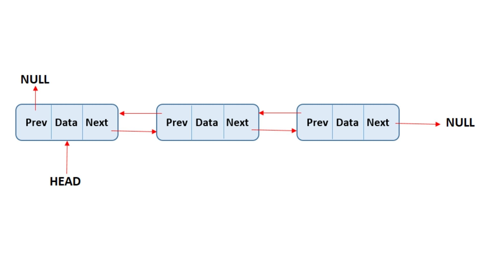

# Listas duplamente encadeadas

<figure><figcaption></figcaption></figure>

Uma **lista duplamente encadeada** é uma estrutura de dados linear formada por **nodos ligados em sequência**, onde cada nodo guarda:

* um **valor**
* uma **referência para o próximo nodo**
* uma **referência para o nodo anterior**

Ela é uma evolução da lista simplesmente encadeada, permitindo que a navegação pela lista aconteça **nos dois sentidos**: do início para o fim e do fim para o início.

<figure><figcaption></figcaption></figure>

### Estrutura básica de uma lista duplamente encadeada

Cada nodo de uma lista duplamente encadeada possui três partes:

* **valor**: o dado armazenado
* **próximo**: referência para o próximo nodo
* **anterior**: referência para o nodo anterior

Visualmente, a ideia é:

```
None ← [10] ⇄ [20] ⇄ [30] → None
```

Diferente da lista simplesmente encadeada, aqui cada nodo “sabe”:

* quem vem depois
* quem veio antes

### Funcionamento geral da lista

* A lista possui um **início (head)** e, em muitos casos, um **fim (tail)**
* É possível percorrer a lista **para frente e para trás**
* As operações ficam mais flexíveis, especialmente remoções e inserções no meio da lista

Essa característica torna a lista duplamente encadeada mais poderosa, porém mais custosa em termos de memória.

### Operações básicas em listas duplamente encadeadas

As operações principais são semelhantes às da lista simplesmente encadeada, mas envolvem **mais ajustes de referências**.

* Inserção de elementos
* Remoção de elementos
* Percurso da lista (ida e volta)
* Busca de valores

### Inserção de elementos

#### Inserção no início

* O novo nodo passa a ser o head
* Ele aponta para o antigo head
* O antigo head passa a apontar de volta para o novo nodo

Essa operação é eficiente e não depende do tamanho da lista.

#### Inserção no final

* O novo nodo passa a ser o último
* Ele aponta para o antigo último
* O antigo último passa a apontar para o novo nodo

Quando existe uma referência para o final da lista (tail), essa operação também é rápida.

### Remoção de elementos

#### Remoção no início

* O segundo nodo passa a ser o novo head
* O ponteiro `anterior` do novo head passa a ser `None`

#### Remoção no meio ou no final

* O nodo anterior passa a apontar para o próximo
* O nodo seguinte passa a apontar para o anterior

Por possuir referência dupla, **não é necessário percorrer a lista para encontrar o nodo anterior**, o que facilita essas operações.

### Percorrendo a lista

Uma grande vantagem da lista duplamente encadeada é o percurso bidirecional:

* Percurso do início para o fim
* Percurso do fim para o início

Isso é útil em aplicações como:

* navegação entre páginas
* listas que precisam de “voltar” e “avançar”
* históricos de ações

### Comparação com listas simplesmente encadeadas

#### Vantagens

* Navegação nos dois sentidos
* Remoções mais simples no meio da lista
* Maior flexibilidade em algumas operações

#### Desvantagens

* Maior consumo de memória
* Código mais complexo
* Mais cuidado necessário ao ajustar ponteiros

### Impacto no desempenho e uso de memória

* **Desempenho**:\
  As operações continuam eficientes, especialmente quando há referências para o início e o fim da lista.
* **Memória**:\
  Cada nodo armazena uma referência extra (`anterior`), aumentando o consumo de memória em relação à lista simplesmente encadeada.

Ou seja:

* Mais flexibilidade
* Mais custo de memória

### Exemplo simples de implementação em Python

```python
class Nodo:
    def __init__(self, valor):
        self.valor = valor
        self.proximo = None
        self.anterior = None


class ListaDuplamenteEncadeada:
    def __init__(self):
        self.head = None

    def inserir_inicio(self, valor):
        novo = Nodo(valor)
        if self.head is not None:
            self.head.anterior = novo
            novo.proximo = self.head
        self.head = novo
```

### A importância das referências duplas

Em listas duplamente encadeadas:

* cada ajuste precisa manter **duas referências corretas**
* um erro pode quebrar a lista em qualquer direção
* o cuidado com os ponteiros é ainda mais importante

> “Em listas duplamente encadeadas, cada nodo conecta o passado e o futuro da lista.”

### Conclusão

As listas duplamente encadeadas ampliam o conceito das listas encadeadas ao permitir a navegação bidirecional entre os elementos, oferecendo maior flexibilidade em operações de inserção e remoção. Em contrapartida, esse ganho funcional vem acompanhado de um maior consumo de memória e de uma implementação mais complexa. Compreender essas vantagens e desvantagens é essencial para que o aluno saiba escolher a estrutura mais adequada para cada problema, consolidando o entendimento sobre desempenho, uso de memória e organização dos dados.
